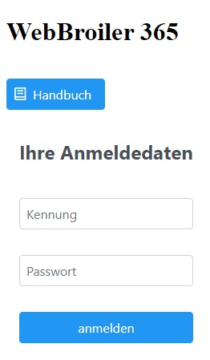

# WebBroiler 365 Handbuch

# Vorwort
WebBroiler ist ein Mastprogramm für Hähnchen. Mit jeden Mastdurchgang können Sie die Einnahmen und Ausgaben dokumentieren. Mit den Mastbericht erhalten Sie einen Überblick über Einstallung, Ausstallungen, Futter, Ausgaben, Einnahmen und daraus abgeleitet einen Erfolgsbericht.

# Anmeldung
Bevor Sie mit der Anwendung arbeiten können, müssen Sie sich anmelden. Die Anmeldung erfolgt mit ihrer E-Mail-Adresse und das dazugehörige Passwort. Bitte wählen Sie ein sicheres Passwort aus. Hilfe bietet Ihnen der Passwort-Manager [Keepass](https://keepass.info/) oder vergleichbare.

# Stammdaten
## Benutzer
## Betriebsangaben und Allgemeine Vorgabewerte
## Ställe und deren Vorgabewerte
## Futter
# Vorgang
## Mastdurchgang
# Berichtswesen
## Mastdurchgang
