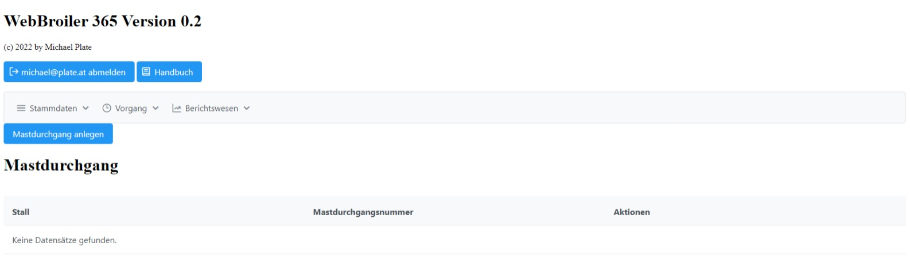
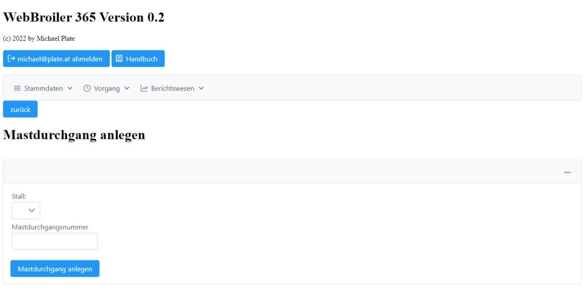
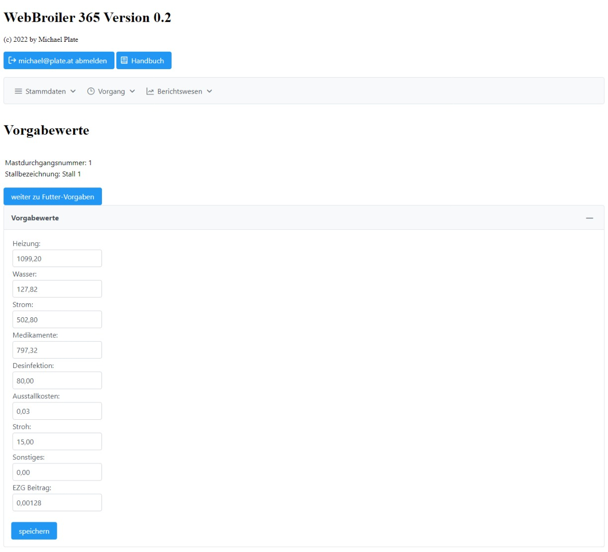
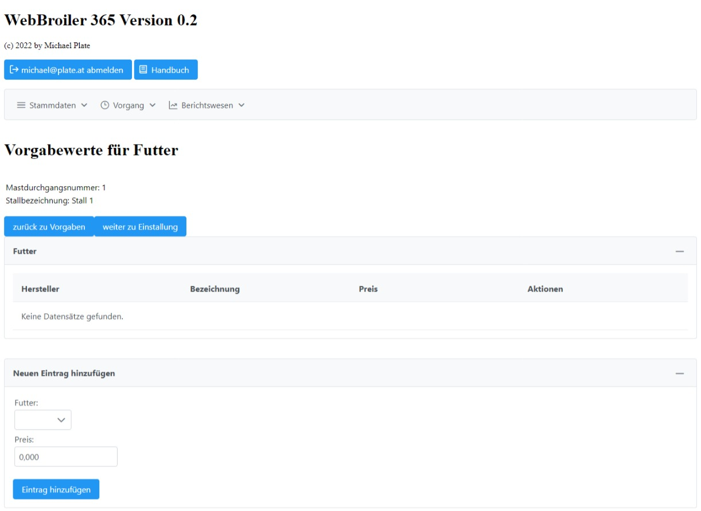
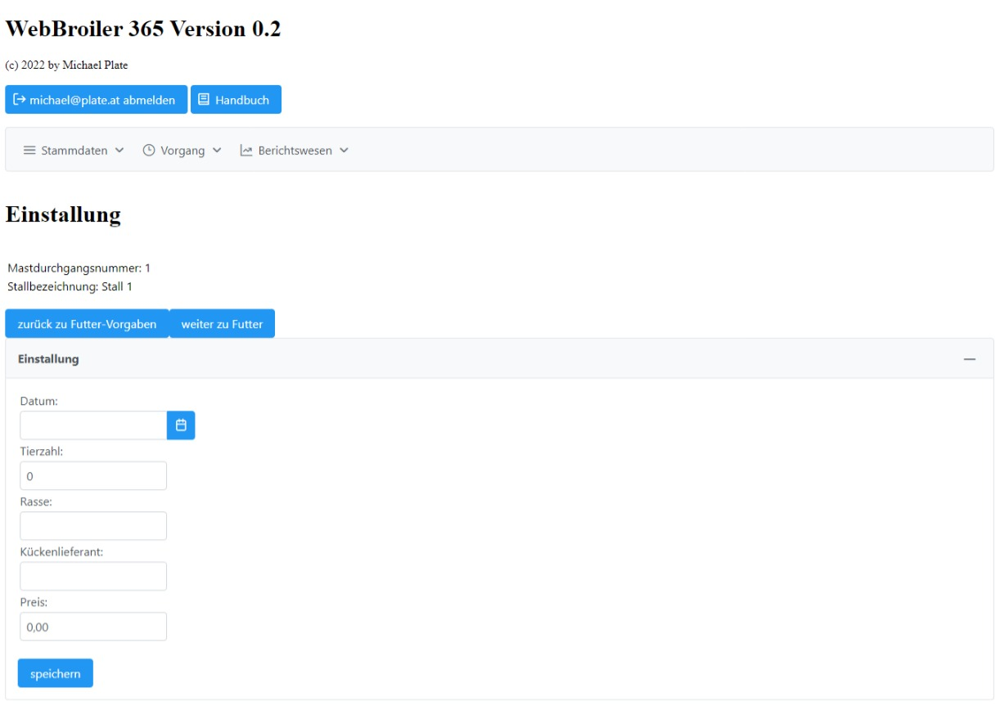
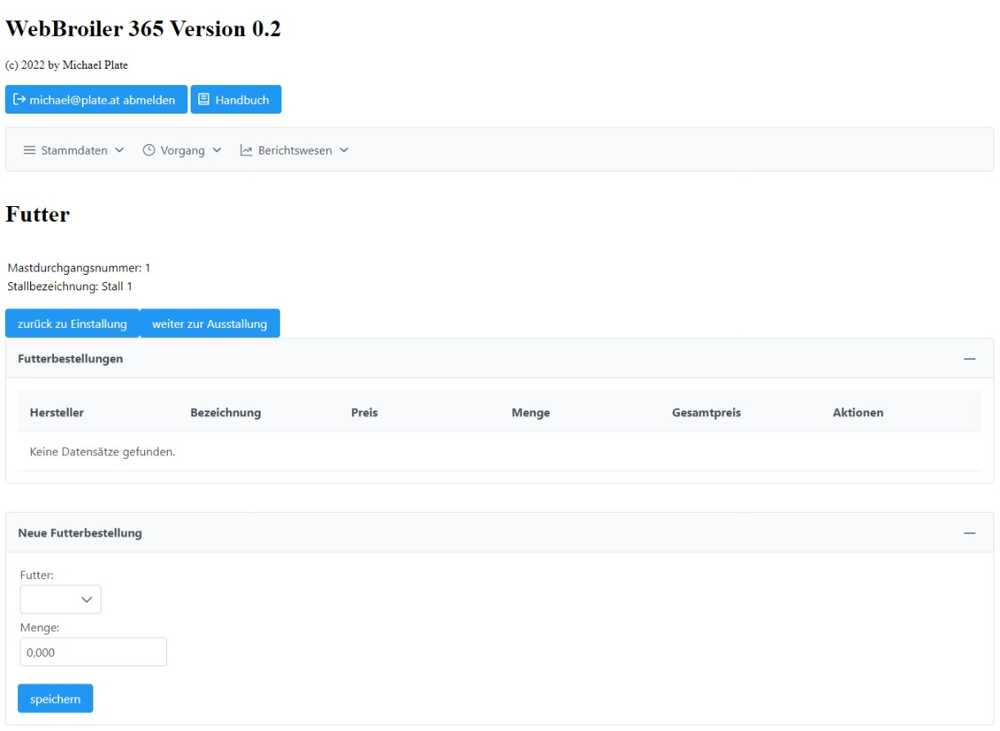
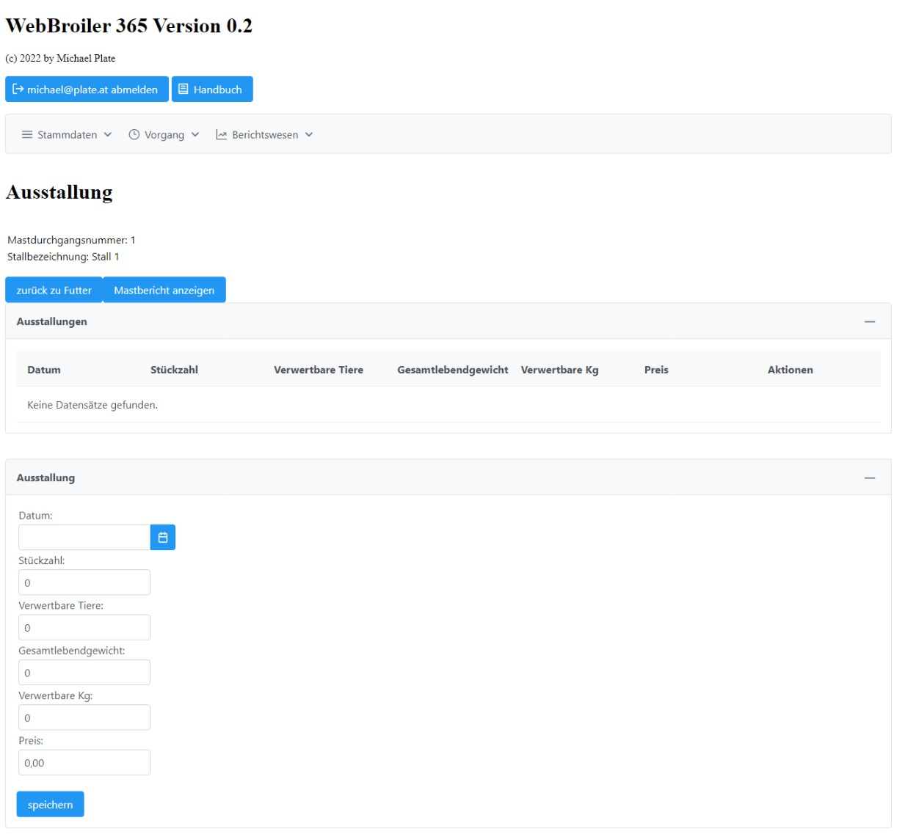
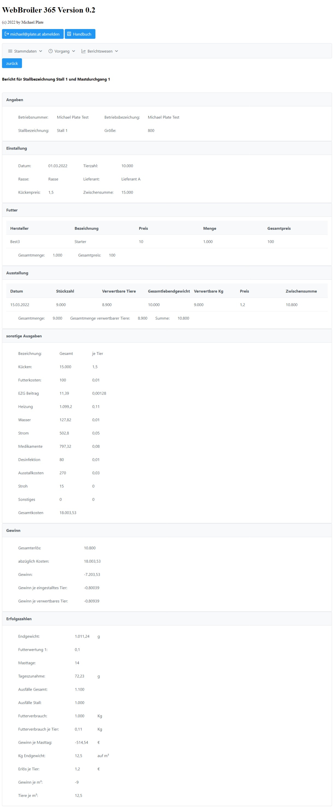

# WebBroiler 365 Handbuch

# Vorwort
WebBroiler ist ein Mastprogramm für Hähnchen. Mit jeden Mastdurchgang können Sie die Einnahmen und Ausgaben dokumentieren. Mit den Mastbericht erhalten Sie einen Überblick über Einstallung, Ausstallungen, Futter, Ausgaben, Einnahmen und daraus abgeleitet einen Erfolgsbericht.

# Anmeldung
Bevor Sie mit der Anwendung arbeiten können, müssen Sie sich anmelden. Die Anmeldung erfolgt mit ihrer E-Mail-Adresse und das dazugehörige Passwort. Bitte wählen Sie ein sicheres Passwort aus. Hilfe bietet Ihnen der Passwort-Manager [Keepass](https://keepass.info/) oder vergleichbare.

Nach der erfolgreichen Anmeldung sehen Sie die Anwendung. Hier können Sie sich wieder abmelden oder die Menüpunkte „Stammdaten“, „Vorgang“ oder „Berichtswesen“ auswählen. Die Menüpunkte werden später näher erläutert.

# Stammdaten
Unter Stammdaten werden die Daten zu Ihrem Betrieb, Ställe und Vorgabewerte gespeichert. Näheres wird später erklärt. Diese Angaben werden beim Anlegen neuer Mastdurchgänge übernommen.

## Benutzer

Auf der Benutzerseite können Sie ihr Passwort ändern. Geben Sie in beide Felder das gleiche Passwort ein und bestätigen Sie mit „Passwort ändern“. Sollte das Passwort nicht identisch sein, bekommen Sie einen Hinweis. Auch hier gilt, wählen Sie ein sicheres Passwort.

## Betriebsangaben und Allgemeine Vorgabewerte

Hier geben Sie ihre Betriebsangaben und allgemeine Vorgabewerte ein.

## Ställe und deren Vorgabewerte

Diese Seite besteht aus zwei Teilen. Der erste Teil ist eine Tabelle und enthält alle Ställe. Mit dem Button „Vorgabewerte bearbeiten“ können Sie die Vorgabewerte bearbeiten. Näheres dazu kommt später.

Mit dem zweiten Teil können Sie ein Stall hinzufügen. Sobald ein neuer Stall hinzugefügt wurde, können Sie in der Tabelle die Vorgabewerte bearbeiten.

Vorgabewerte sind Ihre Ausgaben, die über die Mastdurchgänge nicht oder wenig ändern und betreffen nur den ausgewählten Stall. Andere Ställe können andere Vorgabewerte haben. Diese Werte werden für einen neuen Mastdurchgang herangezogen und Änderungen werden dann auch nur im Mastdurchgang berücksichtigt.

## Futter

Hier verwalten Sie ihre Futterprodukte. Unter „Futter-Hersteller verwalten“ legen Sie Ihre Hersteller an.

Im unteren Abschnitt legen Sie ein neues Futter-Produkt an. Der Hersteller wird hier als Liste angezeigt. Sollte dieser fehlen, dann muss dieser in Futter-Hersteller angelegt werden.

Im oberen Abschnitt ist eine Tabelle mit Futter-Hersteller(n) und deren Produkte. Diese können Sie nachträglich noch ändern.

Beachten Sie bitte, dass diese Änderungen nicht auf die Mastdurchgänge auswirken. Beim Anlegen neuer Mastdurchgänge werden die Angaben dorthin übernommen und müssen auch dort angepasst werden.

# Vorgang
## Mastdurchgang

In der Tabelle befindet sich eine Auflistung früherer Mastdurchgänge und mit „Bearbeiten“ können Sie diese auch nachträglich ändern.

Mit „Mastdurchgang anlegen“ erstellen wir mit einem Assistenten einen neuen Mastdurchgang.

Wählen Sie hier ihren Stall und gebe eine Mastdurchgangsnummer an. Danach klicken Sie auf „Mastdurchgang anlegen“.

Vorgabewerte wurden aus den Stammdaten übernommen und bereits gespeichert. Sollten Sie Änderungen vornehmen, dann bitte danach auf „speichern“ klicken. Ansonsten können Sie mit „weiter zu Futter-Vorgaben“ wechseln.

Mit Futter Vorgaben bauen Sie eine Liste mit Futter und deren Preis zusammen. Diese werden in späterem Schritt herangezogen. Gehen Sie weiter mit „weiter zu Einstallung“.

Unter Einstallung geben Sie alle relevanten zur Einstallung und klicken danach auf „speichern“. Wenn Sie damit fertig sind, wechseln Sie zur nächsten Seite mit „weiter zu Futter“.

Hier kommen die Futter-Vorgaben vor ein paar Schritten zum Einsatz. Wählen Sie Futter aus und die Menge. Mit „speichern“ wird diese in die obige Tabelle übernommen.

Sobald Sie damit fertig sind, gelangen Sie mit „weiter zur Ausstallung“.

Auf diese Seite können Sie auch mehrere Ausstallungen vornehmen. Geben Sie alle relevanten Angaben an und klicken auf „speichern“. Danach erscheint ein Eintrag in der obigen Tabelle. Wenn Sie damit fertig sind, können Sie ihren „Mastbericht anzeigen“ lassen. Mastbericht wird weiter unten beschrieben.

# Berichtswesen
## Mastdurchgang

Hier finden Sie eine Übersicht aller Mastdurchgänge. Durch „anzeigen“ gelangen Sie zu den jeweiligen Mastbericht.

Hinweis vorweg, die Zahlen sind ausgedacht. Im Allgemein haben Sie hier einen kompletten Bericht zum Mastdurchgang mit Einnahmen, Ausgaben und Erfolgszahlen.